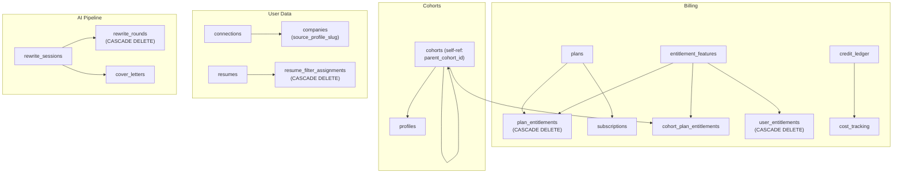

# FK Dependency Graph — v3.87

**Date:** 2026-02-23  
**Database:** 745 MB, 51 tables, 496,875 rows

---

## Foreign Key Constraints (13 total)



## CASCADE DELETE Paths (⚠️ Danger Zones)

| Parent Table | Child Table | FK Column | Impact |
|-------------|------------|-----------|--------|
| plans | plan_entitlements | plan_id | Deleting a plan removes all its entitlement mappings |
| entitlement_features | plan_entitlements | feature_id | Deleting a feature removes it from all plans |
| entitlement_features | user_entitlements | feature_id | Deleting a feature revokes it from all users |
| resumes | resume_filter_assignments | resume_id | Deleting a resume removes all filter assignments |
| rewrite_sessions | rewrite_rounds | session_id | Deleting a session removes all rewrite rounds |

**All other FKs use NO ACTION (safe — will error on constraint violation).**

## Soft References (no FK constraint — manual cleanup required)

| Table | Column | References | Notes |
|-------|--------|------------|-------|
| ats_companies | ref_company_id | ref_companies.id | PDL enrichment link |
| notification_actions | job_id | ats_jobs.greenhouse_id | Text match, not UUID |
| notification_actions | resume_id | resumes.id | Text, not UUID FK |
| notification_log | job_id | ats_jobs.greenhouse_id | Text match |
| rewrite_sessions | resume_id | resumes.id | Text, not UUID FK |
| rewrite_sessions | template_id | Internal template key | Enum-like |
| user_sessions | cohort_id / plan_id | cohorts/plans | Text, denormalized |
| credit_pricing | cohort_id / user_id | cohorts/auth.users | Text/UUID |
| subscriptions | stripe_customer_id | Stripe external | External system |
| user_subscriptions | stripe_customer_id | Stripe external | External system |

## TRUNCATE Protection

19 protected tables have `trg_block_truncate` triggers. Override:
```sql
SET LOCAL bj.allow_truncate = 'true';
TRUNCATE table_name;
```

## Pre-Migration Workflow

```sql
-- 1. Before any schema change
SELECT pre_migration_snapshot('migration-name', 'description');

-- 2. Run migration
-- ...

-- 3. Verify
SELECT verify_migration('migration-name');
```
