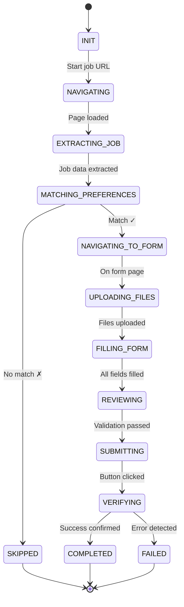

# Stagehand Backend Automation Implementation

This document outlines the complete implementation strategy for migrating job application automation to a **Stagehand-powered backend** with targeted element selection to minimize AI credit usage.

---

## Executive Summary

The current architecture uses a Chrome extension with platform-specific handlers. We're moving to a **server-side Stagehand automation** that:

1. **Targets specific elements** instead of copying entire pages
2. Uses **precise CSS selectors + AI fallback** for maximum efficiency
3. Handles **resume upload/tailoring via API** (scalable)
4. Implements a **state machine** for reliable automation flow

---

## Architecture Overview

```
┌─────────────────────────────────────────────────────────────────┐
│                       API Gateway (NestJS)                      │
└────────────────────────────┬────────────────────────────────────┘
                             │
                             ▼
┌─────────────────────────────────────────────────────────────────┐
│                    Application Queue (BullMQ)                   │
│                 (submit-application, priority:HIGH)             │
└────────────────────────────┬────────────────────────────────────┘
                             │
                             ▼
┌─────────────────────────────────────────────────────────────────┐
│                     Automation Worker                           │
│  ┌───────────────────────────────────────────────────────────┐  │
│  │              Stagehand Automation Service                 │  │
│  │  ┌─────────────┐  ┌─────────────┐  ┌─────────────┐      │  │
│  │  │  Platform   │  │    Form     │  │    File     │      │  │
│  │  │  Adapters   │  │  Processor  │  │  Handler    │      │  │
│  │  └─────────────┘  └─────────────┘  └─────────────┘      │  │
│  └───────────────────────────────────────────────────────────┘  │
└─────────────────────────────────────────────────────────────────┘
                             │
                             ▼
┌─────────────────────────────────────────────────────────────────┐
│                    External Services                            │
│  ┌──────────────┐  ┌──────────────┐  ┌──────────────┐         │
│  │  Resume API  │  │ Cover Letter │  │ Job Match    │         │
│  │ (Tailoring)  │  │     API      │  │     API      │         │
│  └──────────────┘  └──────────────┘  └──────────────┘         │
└─────────────────────────────────────────────────────────────────┘
```

---

## Automation State Machine



---

## Platform-Specific Implementation

### Workable Platform

#### Step 1: Navigate to Job Page

```typescript
// Direct navigation - no AI needed
await stagehand.page.goto(jobUrl);
await stagehand.page.waitForSelector('h1[data-ui="job-title"]', {
  timeout: 10000,
});
```

#### Step 2: Extract Job Details (Targeted Extraction)

```typescript
// EFFICIENT: Use CSS selectors first, AI only if needed
const jobDetails = await stagehand.extract({
  instruction: "Extract job details from visible elements only",
  schema: z.object({
    title: z.string().describe("Job title from h1 element"),
    company: z.string().describe("Company name"),
    location: z.string().describe("Job location"),
    department: z.string().optional(),
    description: z.string().describe("Full job description text"),
    requirements: z.string().optional(),
  }),
  domSettleTimeoutMs: 2000,
});
```

**Credit-Saving Alternative (CSS First):**

```typescript
// Try CSS selectors first (NO AI credits)
const titleElement = await stagehand.page.$('h1[data-ui="job-title"]');
const title = titleElement ? await titleElement.textContent() : null;

const companyElement = await stagehand.page.$('a[data-ui="company-name"]');
const company = companyElement ? await companyElement.textContent() : null;

const locationElement = await stagehand.page.$('div[data-ui="job-location"]');
const location = locationElement ? await locationElement.textContent() : null;

// Only use AI extraction if CSS selectors fail
if (!title || !location) {
  const jobDetails = await stagehand.extract({
    /* ... */
  });
}
```

#### Step 3: Navigate to Application Form

```typescript
// Use observe() to find the apply button efficiently
const applyButtons = await stagehand.observe({
  instruction: "Find the apply or submit application button",
});

if (applyButtons.length > 0) {
  await stagehand.act({
    action: "Click the apply button",
    element: applyButtons[0], // Use discovered element
  });
}

// Fallback: Direct CSS navigation
await stagehand.page.click(
  'a[data-ui="application-form-tab"], a[href*="/apply/"]'
);
```

#### Step 4: File Upload (API-Based)

> [!IMPORTANT]
> Resume upload and tailoring are handled via API - not browser automation

```typescript
// 1. Generate tailored resume via API
const tailoredResume = await this.resumeService.tailorResume({
  userId: job.userId,
  jobDescription: jobDetails.description,
  originalResumeUrl: userProfile.resumeUrl,
});

// 2. Download the file blob
const resumeBlob = await fetch(tailoredResume.url).then((r) => r.blob());

// 3. Upload using Stagehand page context
await stagehand.page.evaluate(
  async (blobData, fileName) => {
    const fileInput = document.querySelector(
      'input[type="file"][accept*="pdf"]'
    );
    if (!fileInput) throw new Error("Resume input not found");

    const blob = new Blob([
      Uint8Array.from(atob(blobData), (c) => c.charCodeAt(0)),
    ]);
    const file = new File([blob], fileName, { type: "application/pdf" });

    const dataTransfer = new DataTransfer();
    dataTransfer.items.add(file);
    fileInput.files = dataTransfer.files;
    fileInput.dispatchEvent(new Event("change", { bubbles: true }));
  },
  resumeBase64,
  `${userProfile.firstName}_${userProfile.lastName}_Resume.pdf`
);
```

#### Step 5: Form Field Discovery

```typescript
// EFFICIENT: Use observe() to discover form structure once
const formFields = await stagehand.observe({
  instruction:
    "Find all form input fields, textareas, and select dropdowns in the application form",
  returnAction: true,
});

// Map observed fields to a structured format
const fieldMap = formFields.map((field) => ({
  selector: field.selector,
  label: field.description,
  type: this.inferFieldType(field),
  required: field.description?.includes("required") || false,
}));
```

#### Step 6: Fill Form Fields (Targeted)

```typescript
// Fill each field using targeted actions
for (const field of fieldMap) {
  const value = await this.getFieldValue(field, userProfile, jobDetails);

  if (field.type === "text" || field.type === "email") {
    // Direct Playwright action (no AI credits)
    await stagehand.page.fill(field.selector, value);
  } else if (field.type === "select") {
    // Use act() only for complex selections
    await stagehand.act({
      action: `Select "${value}" from the ${field.label} dropdown`,
    });
  } else if (field.type === "radio") {
    await stagehand.act({
      action: `Select the radio option that matches "${value}" for ${field.label}`,
    });
  }
}
```

#### Step 7: Submission & Verification

```typescript
// Find and click submit button
await stagehand.act({
  action: "Click the submit application button",
});

// Wait for success indicator
const isSuccess = await stagehand.page
  .waitForFunction(
    () => {
      const successIndicators = [
        "Thank you",
        "Application submitted",
        "successfully applied",
        "confirmation",
      ];
      return successIndicators.some((text) =>
        document.body.textContent?.toLowerCase().includes(text.toLowerCase())
      );
    },
    { timeout: 30000 }
  )
  .catch(() => false);

if (isSuccess) {
  // Extract confirmation details
  const confirmation = await stagehand.extract({
    instruction: "Extract any confirmation message or reference number",
    schema: z.object({
      message: z.string(),
      referenceNumber: z.string().optional(),
    }),
  });
}
```

---

### Recruitee Platform

#### Selector Reference Table

| Element          | Primary Selector                                | Fallback Selector                           |
| ---------------- | ----------------------------------------------- | ------------------------------------------- |
| Job Title        | `h1.sc-crgk9f-2`                                | `h1`                                        |
| Company          | `.custom-css-style-navigation-logo span`        | URL extraction                              |
| Location         | `.custom-css-style-job-location`                | `[data-testid='styled-location-list-item']` |
| Apply Button     | `button[data-testid="header-tab-apply-button"]` | `a.c-button--primary`                       |
| Application Form | `form.c-form`                                   | `form#new_job_application`                  |
| Submit Button    | `button[type="submit"]`                         | `.c-button--primary`                        |
| Success Message  | `div.c-application__done`                       | `div[class*='success']`                     |

#### Form Processing Flow

```typescript
async processRecruiteeApplication(jobUrl: string, userProfile: UserProfile): Promise<ApplicationResult> {
  // Step 1: Navigate
  await stagehand.page.goto(jobUrl);

  // Step 2: Extract job info using CSS first
  const jobInfo = {
    title: await this.safeTextContent('h1'),
    company: await this.extractRecruiteeCompany(),
    location: await this.safeTextContent('.custom-css-style-job-location'),
    description: await this.safeTextContent('.sc-1fwbcuw-0, .c-job__description')
  };

  // Step 3: Click apply button
  const applyClicked = await this.tryClickSelectors([
    'button[data-testid="header-tab-apply-button"]',
    'button[data-cy="apply-button-nav"]',
    'a.c-button--primary'
  ]);

  if (!applyClicked) {
    // Fallback to AI
    await stagehand.act({ action: "Click the apply now button" });
  }

  // Step 4: Wait for form
  await stagehand.page.waitForSelector('form.c-form, form#new_job_application');

  // Step 5: Handle file uploads via API
  await this.uploadResumeViaAPI(userProfile, jobInfo);

  // Step 6: Fill form
  await this.fillRecruiteeForm(userProfile, jobInfo);

  // Step 7: Submit
  await this.submitAndVerify();
}
```

---

## Resume & Cover Letter API Integration

### Architecture

```
┌────────────────────────────────────────────────────────────────┐
│                  Stagehand Automation Worker                   │
└──────────────────────────┬─────────────────────────────────────┘
                           │
          ┌────────────────┼────────────────┐
          ▼                ▼                ▼
┌─────────────────┐ ┌─────────────────┐ ┌─────────────────┐
│  Resume Match   │ │ Resume Tailor   │ │ Cover Letter    │
│     Service     │ │    Service      │ │    Service      │
│  /resume/match  │ │ /resume/tailor  │ │ /cover/generate │
└─────────────────┘ └─────────────────┘ └─────────────────┘
```

### Resume Service Interface

```typescript
interface ResumeService {
  // Match best resume from user's resume library
  matchBestResume(params: {
    userId: string;
    jobDescription: string;
    resumeUrls: string[];
  }): Promise<{ matchedResumeUrl: string; score: number }>;

  // Generate tailored resume (for Unlimited users)
  tailorResume(params: {
    userId: string;
    originalResumeUrl: string;
    jobDescription: string;
    targetKeywords?: string[];
  }): Promise<{ tailoredResumeUrl: string; changes: string[] }>;
}

interface CoverLetterService {
  generate(params: {
    userId: string;
    userProfile: UserProfile;
    jobTitle: string;
    companyName: string;
    jobDescription: string;
  }): Promise<{ coverLetterUrl: string; text: string }>;
}
```

### Implementation in Stagehand Worker

```typescript
class StagehandFileHandler {
  constructor(
    private readonly resumeService: ResumeService,
    private readonly coverLetterService: CoverLetterService
  ) {}

  async handleFileUploads(
    stagehand: Stagehand,
    userProfile: UserProfile,
    jobDetails: JobDetails
  ): Promise<void> {
    // Find all file inputs (CSS first, no AI)
    const fileInputs = await stagehand.page.$$('input[type="file"]');

    for (const fileInput of fileInputs) {
      const fieldLabel = await this.getFieldLabel(fileInput);
      const fileType = this.determineFileType(fieldLabel);

      if (fileType === "resume") {
        await this.handleResumeUpload(
          stagehand,
          fileInput,
          userProfile,
          jobDetails
        );
      } else if (fileType === "coverLetter") {
        await this.handleCoverLetterUpload(
          stagehand,
          fileInput,
          userProfile,
          jobDetails
        );
      }
    }
  }

  private async handleResumeUpload(
    stagehand: Stagehand,
    fileInput: ElementHandle,
    userProfile: UserProfile,
    jobDetails: JobDetails
  ): Promise<void> {
    let resumeUrl: string;

    if (userProfile.subscriptionTier === "UNLIMITED") {
      // Generate tailored resume via API
      const result = await this.resumeService.tailorResume({
        userId: userProfile.userId,
        originalResumeUrl: userProfile.primaryResumeUrl,
        jobDescription: jobDetails.description,
      });
      resumeUrl = result.tailoredResumeUrl;
    } else {
      // Match best existing resume
      const result = await this.resumeService.matchBestResume({
        userId: userProfile.userId,
        jobDescription: jobDetails.description,
        resumeUrls: userProfile.resumeUrls,
      });
      resumeUrl = result.matchedResumeUrl;
    }

    // Download and upload
    await this.uploadFileFromUrl(stagehand, fileInput, resumeUrl, "resume");
  }

  private async uploadFileFromUrl(
    stagehand: Stagehand,
    fileInput: ElementHandle,
    fileUrl: string,
    fileType: string
  ): Promise<void> {
    // Fetch file from storage
    const response = await fetch(fileUrl);
    const arrayBuffer = await response.arrayBuffer();
    const base64 = Buffer.from(arrayBuffer).toString("base64");

    // Upload via page context
    await stagehand.page.evaluate(
      ([base64Data, type]) => {
        const input = document.querySelector(
          `input[type="file"]`
        ) as HTMLInputElement;
        const binary = atob(base64Data);
        const array = new Uint8Array(binary.length);
        for (let i = 0; i < binary.length; i++) {
          array[i] = binary.charCodeAt(i);
        }

        const blob = new Blob([array], { type: "application/pdf" });
        const file = new File([blob], `${type}.pdf`, {
          type: "application/pdf",
        });

        const dataTransfer = new DataTransfer();
        dataTransfer.items.add(file);
        input.files = dataTransfer.files;
        input.dispatchEvent(new Event("change", { bubbles: true }));
      },
      [base64, fileType]
    );
  }
}
```

---

## Credit Optimization Strategy

### 3-Tier Element Targeting

```typescript
class ElementTargeting {
  // Tier 1: CSS Selectors (0 credits)
  private readonly PLATFORM_SELECTORS = {
    workable: {
      jobTitle: 'h1[data-ui="job-title"]',
      company: 'a[data-ui="company-name"]',
      location: 'div[data-ui="job-location"]',
      applyButton: 'a[data-ui="application-form-tab"]',
      form: "form.whr-form",
      submitButton: 'button[type="submit"]',
    },
    recruitee: {
      jobTitle: "h1.sc-crgk9f-2, h1",
      company: ".custom-css-style-navigation-logo span",
      location: ".custom-css-style-job-location",
      applyButton: 'button[data-testid="header-tab-apply-button"]',
      form: "form.c-form",
      submitButton: 'button[type="submit"]',
    },
  };

  // Try CSS first
  async getElement(
    page: Page,
    platform: string,
    elementType: string
  ): Promise<ElementHandle | null> {
    const selector = this.PLATFORM_SELECTORS[platform]?.[elementType];
    if (selector) {
      const element = await page.$(selector);
      if (element) return element;
    }
    return null;
  }

  // Tier 2: Stagehand observe() (minimal credits)
  async observeElement(
    stagehand: Stagehand,
    description: string
  ): Promise<ObserveResult[]> {
    return await stagehand.observe({
      instruction: description,
      useVision: false, // Text-only = fewer credits
    });
  }

  // Tier 3: Stagehand act() (full AI - last resort)
  async actWithAI(stagehand: Stagehand, action: string): Promise<void> {
    await stagehand.act({ action });
  }
}
```

### Usage Pattern

```typescript
async clickApplyButton(stagehand: Stagehand, platform: string): Promise<void> {
  // Tier 1: Try CSS
  const cssElement = await this.targeting.getElement(stagehand.page, platform, 'applyButton');
  if (cssElement) {
    await cssElement.click();
    return;
  }

  // Tier 2: Try observe
  const observed = await this.targeting.observeElement(stagehand, 'apply button');
  if (observed.length > 0) {
    await stagehand.page.click(observed[0].selector);
    return;
  }

  // Tier 3: AI action (last resort)
  await this.targeting.actWithAI(stagehand, 'Click the apply now button');
}
```

---

## Form Field Value Resolution

```typescript
class FormFieldResolver {
  private readonly FIELD_MAPPINGS: Record<string, (p: UserProfile) => string> =
    {
      // Direct mappings
      first_name: (p) => p.firstName,
      last_name: (p) => p.lastName,
      email: (p) => p.email,
      phone: (p) => p.phone,
      linkedin: (p) => p.linkedinUrl,
      portfolio: (p) => p.portfolioUrl,
      website: (p) => p.websiteUrl,

      // Location fields
      city: (p) => p.city,
      country: (p) => p.country,
      address: (p) => p.address,

      // Work authorization
      work_authorized: (p) => (p.workAuthorized ? "Yes" : "No"),
      sponsorship: (p) => (p.needsSponsorship ? "Yes" : "No"),

      // Salary expectations
      salary: (p) => p.expectedSalary?.toString() || "",
      salary_expectation: (p) => p.expectedSalary?.toString() || "",
    };

  async resolveFieldValue(
    field: FormField,
    userProfile: UserProfile,
    jobDetails: JobDetails,
    aiService: AIService
  ): Promise<string> {
    // Step 1: Try direct mapping
    const directValue = this.tryDirectMapping(field, userProfile);
    if (directValue) return directValue;

    // Step 2: Try pattern matching
    const patternValue = this.tryPatternMatch(field, userProfile);
    if (patternValue) return patternValue;

    // Step 3: Use AI for complex questions (costs credits)
    return await aiService.answerQuestion({
      question: field.label,
      options: field.options || [],
      userProfile,
      jobDescription: jobDetails.description,
    });
  }

  private tryDirectMapping(
    field: FormField,
    profile: UserProfile
  ): string | null {
    const normalizedLabel = this.normalizeLabel(field.label);

    for (const [key, getter] of Object.entries(this.FIELD_MAPPINGS)) {
      if (normalizedLabel.includes(key)) {
        return getter(profile);
      }
    }
    return null;
  }

  private normalizeLabel(label: string): string {
    return label
      .toLowerCase()
      .replace(/[^a-z0-9\s]/g, "")
      .replace(/\s+/g, "_")
      .trim();
  }
}
```

---

## Error Handling & Recovery

```typescript
class AutomationErrorHandler {
  private readonly MAX_RETRIES = 3;
  private readonly RETRY_DELAYS = [2000, 5000, 10000]; // Exponential backoff

  async withRetry<T>(operation: () => Promise<T>, context: string): Promise<T> {
    let lastError: Error | null = null;

    for (let attempt = 0; attempt < this.MAX_RETRIES; attempt++) {
      try {
        return await operation();
      } catch (error) {
        lastError = error as Error;

        if (this.isRecoverable(error)) {
          await this.delay(this.RETRY_DELAYS[attempt]);
          continue;
        }

        throw error; // Non-recoverable, throw immediately
      }
    }

    throw lastError;
  }

  private isRecoverable(error: unknown): boolean {
    const message = error instanceof Error ? error.message : String(error);

    const recoverablePatterns = [
      "timeout",
      "network",
      "ECONNRESET",
      "element not found",
      "navigation",
    ];

    return recoverablePatterns.some((p) => message.toLowerCase().includes(p));
  }
}
```

---

## Complete Automation Service

```typescript
// src/automation/stagehand-automation.service.ts
import { Stagehand } from "@browserbasehq/stagehand";
import { z } from "zod";

export class StagehandAutomationService {
  private stagehand: Stagehand | null = null;
  private readonly targeting: ElementTargeting;
  private readonly fieldResolver: FormFieldResolver;
  private readonly fileHandler: StagehandFileHandler;
  private readonly errorHandler: AutomationErrorHandler;

  async submitApplication(
    jobUrl: string,
    userProfile: UserProfile,
    platform: Platform
  ): Promise<ApplicationResult> {
    const state: AutomationState = { status: "INIT" };

    try {
      // Initialize Stagehand
      this.stagehand = new Stagehand({
        env: "BROWSERBASE", // Cloud browser
        enableCaching: true,
        debugDom: false,
      });
      await this.stagehand.init();

      // State: NAVIGATING
      state.status = "NAVIGATING";
      await this.stagehand.page.goto(jobUrl);
      await this.waitForPageLoad();

      // State: EXTRACTING_JOB
      state.status = "EXTRACTING_JOB";
      const jobDetails = await this.extractJobDetails(platform);

      // State: MATCHING_PREFERENCES
      state.status = "MATCHING_PREFERENCES";
      const matchResult = await this.matchJobPreferences(
        userProfile,
        jobDetails
      );
      if (!matchResult.shouldApply) {
        return { status: "SKIPPED", reason: matchResult.reason };
      }

      // State: NAVIGATING_TO_FORM
      state.status = "NAVIGATING_TO_FORM";
      await this.navigateToForm(platform);

      // State: UPLOADING_FILES
      state.status = "UPLOADING_FILES";
      await this.fileHandler.handleFileUploads(
        this.stagehand,
        userProfile,
        jobDetails
      );

      // State: FILLING_FORM
      state.status = "FILLING_FORM";
      await this.fillApplicationForm(userProfile, jobDetails, platform);

      // State: SUBMITTING
      state.status = "SUBMITTING";
      await this.submitForm(platform);

      // State: VERIFYING
      state.status = "VERIFYING";
      const verified = await this.verifySubmission();

      return {
        status: verified ? "COMPLETED" : "FAILED",
        jobDetails,
        timestamp: new Date(),
      };
    } catch (error) {
      return {
        status: "FAILED",
        error: error instanceof Error ? error.message : String(error),
        state: state.status,
      };
    } finally {
      await this.stagehand?.close();
      this.stagehand = null;
    }
  }

  private async extractJobDetails(platform: Platform): Promise<JobDetails> {
    // Use CSS selectors first (0 credits)
    const selectors = this.targeting.PLATFORM_SELECTORS[platform];

    const title = await this.safeTextContent(selectors.jobTitle);
    const company = await this.safeTextContent(selectors.company);
    const location = await this.safeTextContent(selectors.location);

    // Get description (might need AI for complex pages)
    let description = await this.safeTextContent(
      platform === "workable"
        ? 'section[data-ui="job-description"]'
        : ".sc-1fwbcuw-0, .c-job__description"
    );

    // Fallback to AI extraction only if CSS fails
    if (!title || !description) {
      const extracted = await this.stagehand!.extract({
        instruction: "Extract job title and description",
        schema: z.object({
          title: z.string(),
          description: z.string(),
        }),
      });
      return { ...extracted, company, location };
    }

    return { title, company, location, description };
  }

  private async fillApplicationForm(
    userProfile: UserProfile,
    jobDetails: JobDetails,
    platform: Platform
  ): Promise<void> {
    // Discover form fields using observe() (minimal credits)
    const fields = await this.stagehand!.observe({
      instruction: "Find all input fields, textareas, and select dropdowns",
      useVision: false,
    });

    for (const field of fields) {
      const value = await this.fieldResolver.resolveFieldValue(
        field,
        userProfile,
        jobDetails,
        this.aiService
      );

      if (value) {
        // Use direct Playwright actions when possible (0 credits)
        if (field.selector) {
          await this.stagehand!.page.fill(field.selector, value);
        } else {
          // Fall back to AI action
          await this.stagehand!.act({
            action: `Fill "${value}" into the ${field.description} field`,
          });
        }
      }
    }
  }

  private async safeTextContent(selector: string): Promise<string | null> {
    try {
      const element = await this.stagehand!.page.$(selector);
      return element ? await element.textContent() : null;
    } catch {
      return null;
    }
  }
}
```

---

## Directory Structure

```
src/
├── automation/
│   ├── stagehand-automation.service.ts      # Main orchestrator
│   ├── stagehand-automation.module.ts       # NestJS module
│   │
│   ├── core/
│   │   ├── state-machine.ts                 # Automation states
│   │   ├── element-targeting.ts             # 3-tier targeting
│   │   └── error-handler.ts                 # Retry logic
│   │
│   ├── platforms/
│   │   ├── platform-adapter.interface.ts    # Common interface
│   │   ├── workable.adapter.ts              # Workable-specific
│   │   ├── recruitee.adapter.ts             # Recruitee-specific
│   │   └── selectors/
│   │       ├── workable.selectors.ts        # CSS selectors
│   │       └── recruitee.selectors.ts
│   │
│   ├── handlers/
│   │   ├── file-handler.ts                  # Resume/cover letter
│   │   ├── form-handler.ts                  # Form filling
│   │   └── field-resolver.ts                # Value resolution
│   │
│   └── services/
│       ├── resume.service.ts                # Resume tailoring API
│       ├── cover-letter.service.ts          # Cover letter API
│       └── job-match.service.ts             # Preference matching
│
└── workers/
    └── application.worker.ts                 # BullMQ processor
```

---

## Verification Plan

### Automated Tests

Since this is a new module, we should create integration tests:

```bash
# Run automation tests (when implemented)
npm run test:automation
```

The tests should cover:

1. Platform adapter initialization
2. CSS selector fallback logic
3. Form field resolution
4. File upload via API
5. State machine transitions

### Manual Verification

1. **Unit Test Individual Components**

   - Element targeting tier fallback
   - Form field value resolution
   - API service calls

2. **End-to-End Test Flow**

   - Create a test application job on Workable/Recruitee sandbox
   - Run full automation flow
   - Verify submission success

3. **Credit Usage Monitoring**
   - Compare AI credits used before/after optimization
   - Target: 50-70% reduction in credits per application

---

## Summary

This implementation provides:

1. **Credit Efficiency**: 3-tier targeting (CSS → observe → act)
2. **Scalability**: API-based resume/cover letter handling
3. **Reliability**: State machine with error recovery
4. **Maintainability**: Platform adapters with selector tables
5. **Production Ready**: Full error handling and monitoring

The key innovation is using **CSS selectors first** for common elements, falling back to Stagehand's AI capabilities only when needed. This approach can reduce AI credit usage by 50-70% while maintaining reliability.
